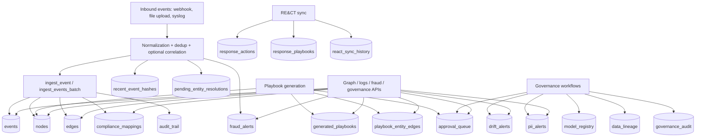

# Concord Graph Data Map

Last updated: 2026-02-23

This maps how data moves through Concord's `concord_graph` database (SQLite), based on:

- Code paths in `src/web/graph_database.py` and active API/service writers
- Live schema inspection of `data/concord_graph.db` in this workspace

## 1. Storage Model

`ConcordGraphDB` is the main persistence layer. Core schema is initialized in `src/web/graph_database.py`.

## 2. Table Groups and Data Owners

| Domain | Tables | Main writers | Main readers |
|---|---|---|---|
| Graph core | `nodes`, `edges`, `events` | `ingest_event`, `ingest_events_batch`, narrative/investigation/playbook helpers | `/api/graph/*`, `/api/logs/*`, incidents/threat APIs |
| Compliance + provenance | `compliance_mappings`, `audit_trail`, `recent_event_hashes`, `pending_entity_resolutions` | ingest webhook/syslog flows, `ingest_event`, entity-resolution handlers | graph compliance/audit endpoints, ingestion resolution endpoints |
| Governance | `approval_queue`, `drift_alerts`, `pii_alerts`, `model_registry`, `data_lineage`, `governance_policies`, `governance_audit` | governance APIs plus demo seeding paths | `/api/governance/*`, `/api/drift/*`, `/api/pii/*`, executive views |
| RE&CT corpus | `response_actions`, `response_playbooks`, `response_action_entity_mapping`, `react_sync_history` | `react_service.sync_from_github` | playbook search/generation APIs |
| Generated response graph | `generated_playbooks`, `playbook_entity_edges` | `playbook_generator.generate_playbook` | `/api/playbooks/generated*`, graph views |
| Fraud | `fraud_alerts` | webhook/syslog fraud rules evaluation | `/api/fraud/*` |

## 3. Canonical Flows

### 3.1 Event ingestion (highest volume)

1. Source arrives via:
   - `/api/ingest/webhook` (`src/web/api/ingest.py`)
   - file upload ingestion (`src/web/api/ingest.py`)
   - syslog pipeline (`src/web/syslog_listener.py`)
2. Events are normalized (Universal Adapter), optionally enriched (baseline, correlation).
3. Dedup hash is checked in `recent_event_hashes` (webhook path).
4. `ingest_event(...)` writes:
   - `events` row (raw + normalized queryable columns)
   - extracted entities into `nodes` via `add_node`
   - pairwise entity links into `edges` via `add_edge`
   - `compliance_mappings` rows
   - `audit_trail` entry (`event_ingested`)
5. Optional fraud evaluation writes `fraud_alerts`.
6. Optional entity resolution:
   - auto-approve => `edges.relationship_type='resolved_to'`
   - borderline => `pending_entity_resolutions`

### 3.2 Batch syslog path

`ingest_events_batch(...)` (production syslog batch mode) writes fast-path records:

- Inserts `events` in bulk
- Inserts `nodes` in bulk (`INSERT OR IGNORE`)
- Inserts `compliance_mappings` in bulk
- Skips embeddings and audit by default
- Does not create `edges` in the batch method itself

Embeddings are backfilled asynchronously by `AsyncEmbeddingGenerator` (`events.embedding`).

### 3.3 RE&CT and playbook lifecycle

1. `react_service.sync_from_github` upserts:
   - `response_actions`
   - `response_playbooks`
   - `react_sync_history`
2. `playbook_generator.generate_playbook` writes:
   - `generated_playbooks`
   - `playbook_entity_edges` (and creates/updates related `nodes`)
3. Review/approval state is read and updated through playbook/governance APIs.

### 3.4 Governance lifecycle

- Queue and decisions: `approval_queue` + `governance_audit`
- Drift: `drift_alerts` + audit
- PII: `pii_alerts` + audit
- Model and lineage records: `model_registry`, `data_lineage` + audit

## 4. Key IDs and Linking Rules

- `nodes.id`: MD5 of `entity_type:value` in `add_node`
- `edges.id`: MD5 of `source_id:target_id:relationship_type`
- `events.id`: UUID
- `compliance_mappings.event_id -> events.id`
- `playbook_entity_edges.playbook_id -> generated_playbooks.id`
- `playbook_entity_edges.entity_node_id -> nodes.id`
- `fraud_alerts.event_id -> events.id`

## 5. Local DB Snapshot (this workspace)

From `data/concord_graph.db` at 2026-02-23:

- `events`: 16
- `nodes`: 2
- `edges`: 0
- `compliance_mappings`: 272
- `approval_queue`: 4
- `drift_alerts`: 4
- `pii_alerts`: 4
- Most RE&CT and generated playbook tables: 0 rows

## 6. Integration Gaps To Be Aware Of

These affect flow correctness and should be considered when interpreting data:

- `connector_polling_service` calls `upsert_entity` / `add_relationship`, but `ConcordGraphDB` exposes `add_node` / `add_edge`.
- `fraud_rules_engine` calls `get_recent_events_by_identity`, which is not implemented on `ConcordGraphDB`.
- `api/narratives.py` uses `get_edges_for_node`, which is not implemented on `ConcordGraphDB`.
- `api/logs.py` imports `GraphDatabase`; the class in `graph_database.py` is `ConcordGraphDB`.
- `playbook_generator._submit_for_review` inserts `approval_queue` columns (`confidence_score`, `review_reason`, `sla_hours`) that are not in the current `approval_queue` schema.
- `investigation_engine` and `unified_narrative_service` build string node IDs when creating edges; core graph node IDs are MD5 hashes from `add_node`.
- SQLite foreign keys are not enabled by default (`PRAGMA foreign_keys=0` in this DB), so edge references can be inserted even when target/source nodes do not exist.
- Default DB path in code is relative to `src/` when `DB_PATH` is unset, while deployment env files set `DB_PATH=/data/concord_graph.db`; ensure all services use the same file.
